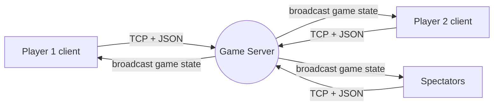

# 🐍 Snake Arena — Real-Time Multiplayer Game over TCP

A two-player online **Snake battle game** written in Python, built around a
custom **client–server networking stack**: raw **TCP sockets**, a
**multithreaded server**, and a **JSON message protocol**. One machine hosts the
game; players connect from their own laptops, battle in real time, and
spectators can watch and cheer live.

> Group project for **EECE 350 – Computer Networks** (one of 3 team members), built March–April 2026.

---

## 🧠 What this project demonstrates

- **Network programming** — a TCP server built directly on Python `socket`, handling many simultaneous connections.
- **Concurrency** — each client runs on its own `thread`, with a separate thread driving the authoritative game loop; shared state is guarded with locks.
- **Protocol design** — a newline-delimited JSON message protocol, with buffering logic that reassembles complete messages out of arbitrary TCP byte chunks.
- **Client–server architecture** — an authoritative server (all game logic and rules) and a thin rendering client, so every player sees a consistent world.
- **Real-time state synchronization** — the server broadcasts game snapshots at a fixed tick rate to players and spectators.
- **GUI development** — a full `pygame` interface: menus, lobby, live match view, chat, and results.

**Tech:** Python · `socket` · `threading` · `json` · `pygame`

---

## 🏗️ Architecture



The **server** is authoritative: it owns all movement, collisions, scoring, and
timing, then broadcasts the resulting state. Clients only send intent
(`{"type": "move", "direction": "UP"}`) and draw whatever the server reports.

| File | Responsibility |
|------|----------------|
| **`server.py`** | TCP server: accepts clients (one thread each), runs the game loop, resolves game logic, broadcasts state. Standard library only. |
| **`client.py`** | `pygame` client: connects over TCP, sends player actions, renders the lobby and live match. |
| **`test_protocol.py`** | Headless end-to-end test of the whole network protocol (no GUI needed). |

**Protocol:** every message is a JSON object terminated by `\n`. Example flow:
`login` → `get_players` → `invite_player` / `accept_invite` → `move` / `chat` →
server `state` broadcasts → `game_over`.

---

## ▶️ Running it

The **server uses only standard Python** (no install). The **client** needs `pygame`:

```bash
pip3 install pygame
```

**1. Start the server** (one machine):
```bash
python3 server.py 5000
```

**2. Start a client** (each player):
```bash
python3 client.py
```
In the setup screen, enter the **Server IP** (`127.0.0.1` if it's the same
computer, otherwise the host's local IP), the **Port** (`5000`), and a
**username**. Players meet in the lobby; one invites the other and the match begins.

---

## ✅ Testing (no GUI required)

`test_protocol.py` spins up two simulated players and verifies the full protocol
end-to-end — login, duplicate-name rejection, lobby listing, invite/accept,
JSON state broadcasting, movement, and match completion:

```bash
python3 server.py 5000        # terminal 1
python3 test_protocol.py 5000 # terminal 2
```

---

## 🎮 Gameplay

- Your snake starts moving after your first direction key.
- **Pies** restore health — normal `+10`, bonus `+20` — and grow your snake.
- **Walls** `-15`, **obstacles** `-20`, **spikes** `-30` damage.
- A **rabbit** appears mid-match and grants a 5-second shield.
- After 60 seconds (or when a snake hits 0 health), the higher-health snake wins.
- Extras: in-match **chat** between players and **live cheers** from spectators.

---

## 👥 Team

Built by **Tatiana Yammine**, **Celena Saadeh**, and **Andrew Sleiman**
for EECE 350 – Computer Networks.

## 📄 License

Released under the [MIT License](LICENSE) — © 2026 Tatiana Yammine, Celena Saadeh, Andrew Sleiman.
